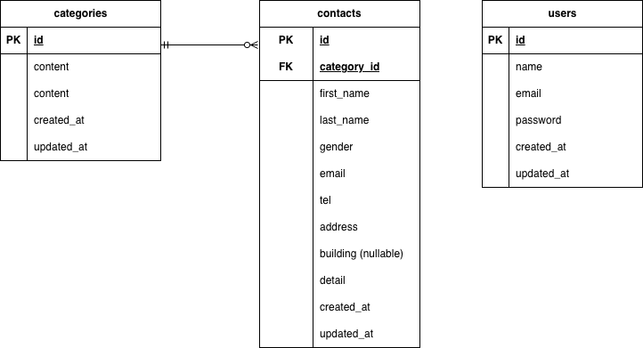

# contact-form_test

## 環境構築

Dockerビルド

1. git clone git@github.com:【自分のリポジトリURL】
2. docker-compose up -d --build

Laravel環境構築

1. docker-compose exec php bash
2. composer install
3. cp .env.example .env
4. php artisan key:generate
5. php artisan migrate
6. php artisan db:seed

## 使用技術（実行環境）

・PHP 8.1
・Laravel 8.75
・MySQL 8.0
・nginx 1.21.1
・Docker 29.1.3

## ER図

## 開発環境

・お問い合わせ画面：http://localhost/
・ユーザー登録：http://localhost/register
・phpMyAdmin：http://localhost:8080/